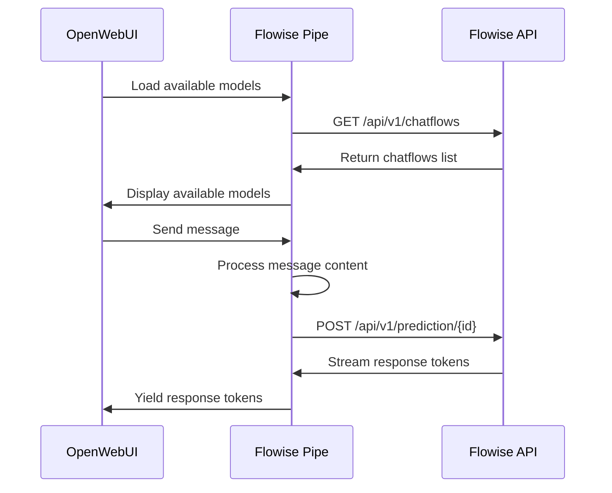

# Flowise Integration for OpenWebUI

An OpenWebUI pipe that provides seamless integration with Flowise AI workflows, featuring dynamic model loading, real-time streaming, and UI feedback.

## ✨ Features

- **Dynamic Model Discovery**: Automatically loads and displays all available Flowise chatflows
- **Streaming Support**: Real-time response streaming with proper token handling
- **Rich Status Indicators**: Visual feedback with emojis and progress updates
- **Robust Error Handling**: Comprehensive error management with helpful messages
- **Debug Mode**: Detailed logging for troubleshooting and development
- **Flexible Response Handling**: Supports multiple Flowise response formats
- **Session Management**: Maintains conversation context across messages
- **Unicode Support**: Proper handling of international characters and emojis

## 🚀 Quick Start

### Prerequisites

- OpenWebUI instance
- Flowise AI instance running and accessible
- Flowise API key (if authentication is enabled)

### Installation

1. **Download the script**:
   
   **Option A - Clone the repository:**
   ```bash
   git clone git@github.com:Karhal/openwebui-flowise-pipe.git
   cd openwebui-flowise-pipe
   ```
   
   **Option B - Download directly (if public):**
   ```bash
   wget https://raw.githubusercontent.com/Karhal/openwebui-flowise-pipe/main/flowise.py
   ```
   
   **Option C - Download and save manually:**
   - Go to https://github.com/Karhal/openwebui-flowise-pipe
   - Click on `flowise.py` 
   - Click "Raw" button
   - Save the file locally

2. **Set environment variables**:
   ```bash
   export FLOWISE_API_URL="http://your-flowise-instance:3001"
   export FLOWISE_API_KEY="your-api-key-here"  # Optional if no auth
   ```

3. **Install in OpenWebUI**:
   - Go to Settings → Pipelines
   - Click "Add Pipeline"
   - Upload `flowise.py`
   - Configure the pipeline settings

### Configuration

The pipe can be configured through environment variables or the OpenWebUI interface:

| Variable | Description | Default | Required |
|----------|-------------|---------|----------|
| `FLOWISE_API_URL` | Flowise instance URL | `http://localhost:3001` | Yes |
| `FLOWISE_API_KEY` | Flowise API key | `""` | No* |
| `enable_status_indicator` | Show status updates | `true` | No |
| `emit_interval` | Status update frequency (seconds) | `1.0` | No |
| `timeout` | Request timeout (seconds) | `120` | No |
| `debug_mode` | Enable debug logging | `false` | No |

*Required if your Flowise instance has authentication enabled.

## 🎯 Usage

### Basic Usage

1. **Select a Flowise Model**: After installation, available Flowise chatflows will appear in your model selector with descriptive emojis:
   - 🤖 Agent-based flows
   - 💬 Chat flows
   - 🔄 Other workflow types

2. **Start Chatting**: Send messages normally through OpenWebUI. The pipe will:
   - Show real-time status updates
   - Stream responses as they're generated
   - Maintain conversation context

### Advanced Features

#### Debug Mode

Enable debug mode to troubleshoot issues:

```python
# In the pipe configuration or environment
debug_mode = True
```

This will log detailed information about:
- Request/response data
- Flowise API communication
- Streaming data parsing
- Error details

#### Session Management

The pipe automatically manages conversation sessions using OpenWebUI's chat ID, ensuring context is maintained across the conversation.

#### Custom Response Handling

The pipe supports multiple Flowise response formats:
- `text` field (standard)
- `message` field
- `content` field
- `response` field
- Raw text responses
- Streaming token events

## 🔧 Troubleshooting

### Common Issues

#### "Response ready!" but no actual response

**Cause**: Usually indicates a response format issue or streaming problem.

**Solution**:
1. Enable debug mode
2. Check the logs for response format
3. Verify Flowise is returning expected data

#### Connection timeouts

**Cause**: Flowise instance is slow or unreachable.

**Solutions**:
- Increase the timeout value
- Check Flowise instance health
- Verify network connectivity

#### No chatflows appear

**Causes & Solutions**:
- **Missing API key**: Set `FLOWISE_API_KEY` if required
- **Wrong URL**: Verify `FLOWISE_API_URL` is correct
- **Network issues**: Check connectivity to Flowise
- **Authentication**: Ensure API key has proper permissions

#### Streaming not working

**Solutions**:
- Check if Flowise supports streaming for your workflow
- Verify the chatflow configuration
- Enable debug mode to see streaming data

### Debug Information

When debug mode is enabled, you'll see detailed logs including:

```
Debug - Request URL: http://localhost:3001/api/v1/prediction/abc123
Debug - Request data: {
  "question": "Hello",
  "overrideConfig": {
    "sessionId": "session_123456"
  },
  "streaming": true
}
Debug - Response status: 200
Debug - Streaming line: data: {"event":"token","data":"Hello"}
```

## 🏗️ Architecture

### Core Components

```
┌─────────────────┐    ┌──────────────────┐    ┌─────────────────┐
│   OpenWebUI     │───▶│  Flowise Pipe    │───▶│   Flowise API   │
│                 │    │                  │    │                 │
│ • Chat Interface│    │ • Model Discovery│    │ • Chatflows     │
│ • Model Selector│    │ • Stream Handling│    │ • AI Workflows  │
│ • Status Display│    │ • Error Handling │    │ • Predictions   │
└─────────────────┘    └──────────────────┘    └─────────────────┘
```

### Flow Diagram



### Response Processing

The pipe handles multiple response formats from Flowise:

1. **Streaming Responses**: Server-Sent Events (SSE) with token data
2. **Non-Streaming**: JSON responses with various field names
3. **Error Responses**: HTTP errors with descriptive messages

## 🤝 Contributing

### Development Setup

1. Clone the repository
2. Set up a local Flowise instance for testing
3. Configure environment variables
4. Test with various chatflow types

### Code Style

- Follow PEP 8 guidelines
- Add type hints for all functions
- Include comprehensive error handling
- Write descriptive docstrings
- Add debug logging for troubleshooting

### Testing

Test the pipe with:
- Different Flowise chatflow types
- Various message formats (text, structured content)
- Error conditions (network issues, invalid responses)
- Both streaming and non-streaming modes

## 📝 License

This project is licensed under the MIT License - see the LICENSE file for details.

## 🙏 Acknowledgments

- [OpenWebUI](https://github.com/open-webui/open-webui) for the excellent chat interface
- [Flowise](https://github.com/FlowiseAI/Flowise) for the powerful AI workflow platform
- The open-source community for inspiration and support

## 📚 Related Resources

- [OpenWebUI Documentation](https://docs.openwebui.com/)
- [Flowise Documentation](https://docs.flowiseai.com/)
- [OpenWebUI Pipelines Guide](https://docs.openwebui.com/pipelines/)

---

**Need help?** Open an issue with:
- Your OpenWebUI version
- Flowise version and configuration
- Debug logs (with sensitive data removed)
- Steps to reproduce the issue